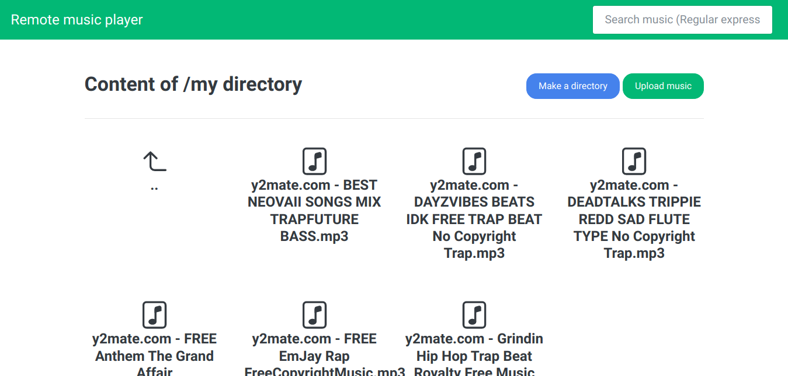

# Remote music player

Play your musics in your lan.



## Getting started

First clone this repository:

```sh
mkdir -p ~/repo/
cd ~/repo
git clone https://github.com/AlphaTechnolog/Remote-Music-Player remote-music-player
cd ./remote-music-player
ls
```

With the `ls` command, the result is:

```
server
client
```

## Explain

This is app is conformed by two subapps:

- server: The API for manage the app storage
- client: The frontend for the app, graphic and user view, consume the API

## Configuring the app

To configure the app see the next documentations:

- [Server documentation](./server/README.md)
- [Client documentation](./client/README.md)
